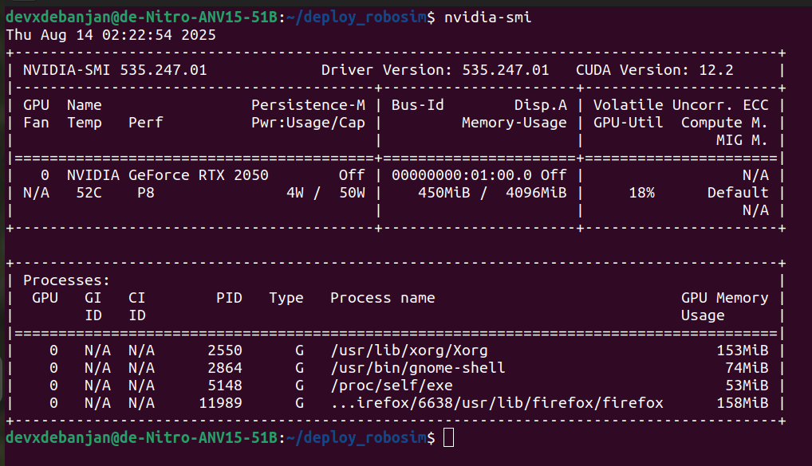

### For using GPU Acceleation while running the Docker Image on a Server, it would need to install Nvidia Drivers if not installed already

To Check if the Driver is already installed and correctly configured, use the command `nvidia-smi` . If you can see the details of your GPU and driver skip to the Runtime Configuration Zone. 

Sample Correct Output:



1. For Ubuntu 22.04 LTS use the command:
```bash
sudo apt update
sudo apt install -y nvidia-driver-535
```
2. Then reboot:
```bash
sudo reboot
```

> Note: Look up the compatible Nvidia Drivers for your GPU if 535 does not work for you

### Next the runtime of docker has to be modified and to support this, some tools have to be downloaded

These tools are partially taken from [here](https://docs.nvidia.com/datacenter/cloud-native/container-toolkit/latest/install-guide.html#prerequisites)

1. Configure the production repository:
```bash
curl -fsSL https://nvidia.github.io/libnvidia-container/gpgkey | sudo gpg --dearmor -o /usr/share/keyrings/nvidia-container-toolkit-keyring.gpg \
  && curl -s -L https://nvidia.github.io/libnvidia-container/stable/deb/nvidia-container-toolkit.list | \
    sed 's#deb https://#deb [signed-by=/usr/share/keyrings/nvidia-container-toolkit-keyring.gpg] https://#g' | \
    sudo tee /etc/apt/sources.list.d/nvidia-container-toolkit.list
```
2. Update the packages list from the repository:
```bash
sudo apt-get update
```
3. Install the `nvidia-container-toolkit`:
```bash
sudo apt-get install -y nvidia-container-toolkit
```
4. Configure Docker to Use the NVIDIA Runtime:
```bash
sudo nvidia-ctk runtime configure --runtime=docker
```
5. Restart Docker to Apply Changes:
```bash
sudo systemctl restart docker
```
6. Configure Containerd to Use the NVIDIA Runtime:
```bash
sudo nvidia-ctk runtime configure --runtime=containerd
```
### Now Verify using:
```bash
nvidia-smi
```
If you can see your GPU details in the terminal, you are good to resume your docker server setup.
