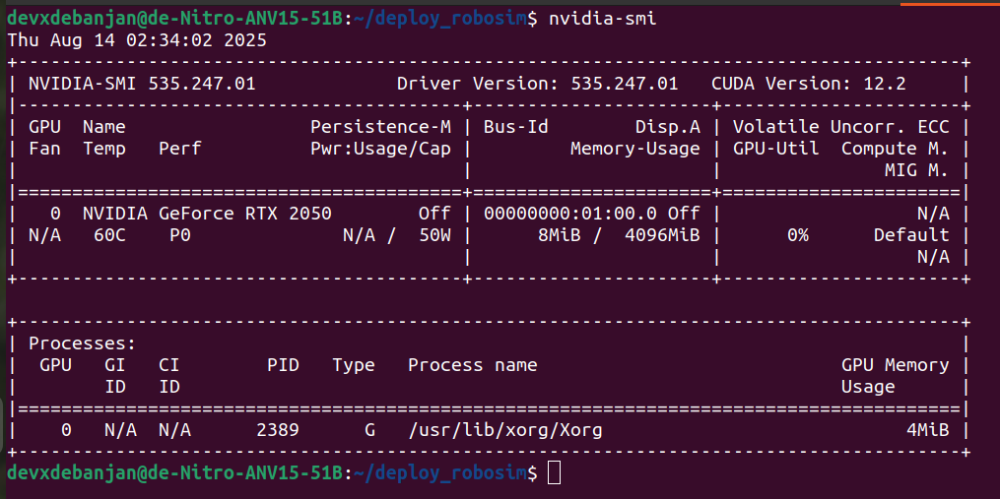
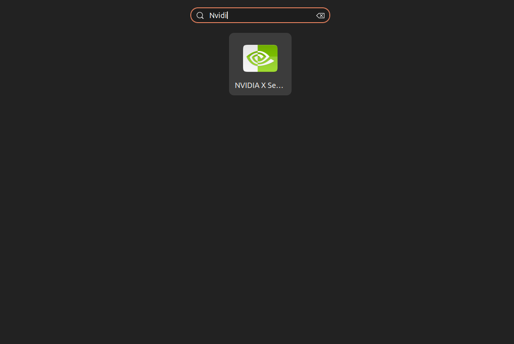
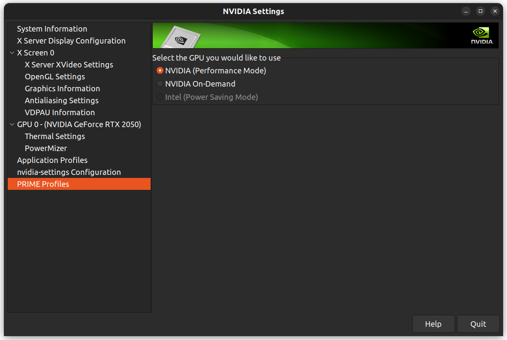
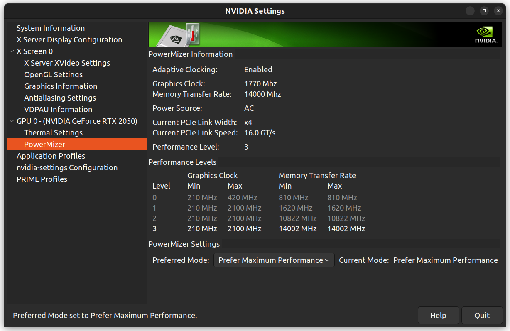
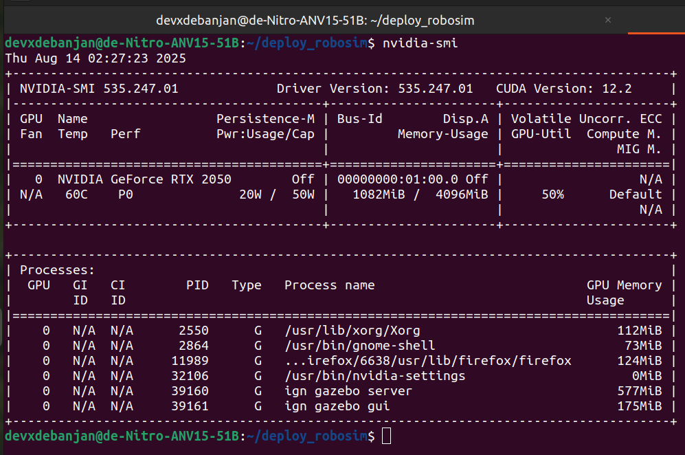

# NVIDIA X SERVER SETTINGS

Without configuring the NVIDIA X Server Settings, the gazebo environment utilising the GPU is not certain. Therefore we make some changes.

1. Run the Docker file before any change in the NVIDIA X Server Settings. It will not show you any Gazebo Process Logs:

2. Go to Nvidia X Server Settings.

3. Navigate to Prime Profile AND Set your GPU to Performance Mode

 

Set your PowerMizer to Maximum Preference

4. Reboot and then run the docker image again. This time the output shows: 

This ensures the the GPU is being used correctly by the docker service and the system must be much lighter now on the CPU.