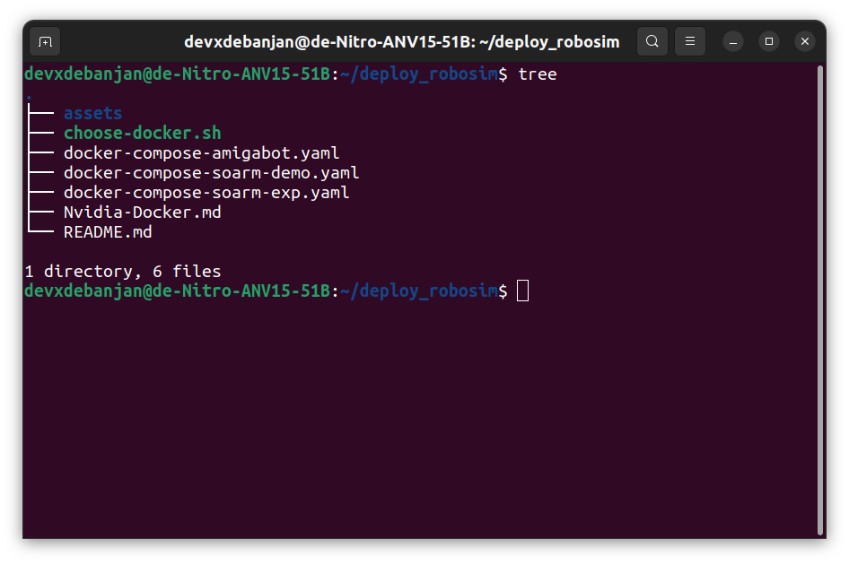
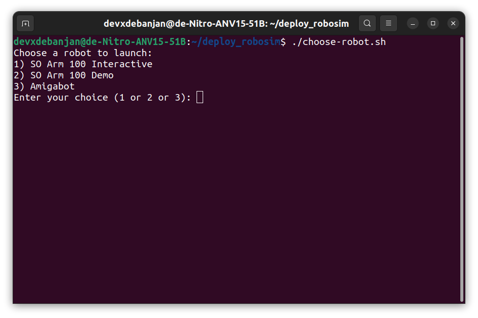
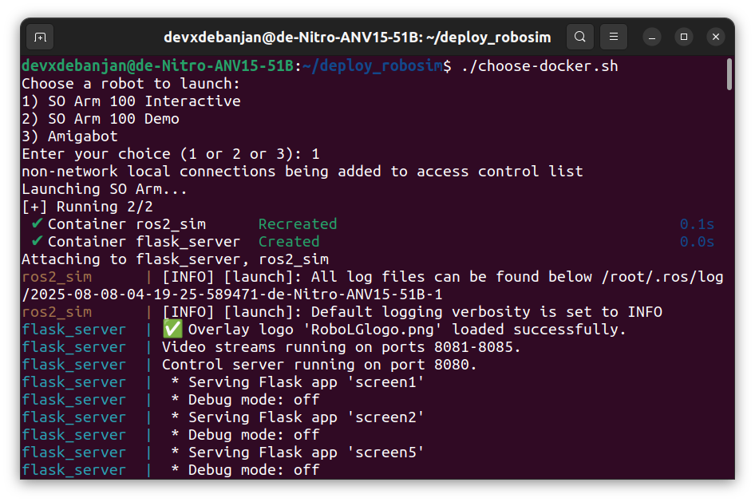

## This is the Setup Documentation for Docker Server of Robotics Simulation for Liquid Galaxy Project

### Prerequisites

- OS: Linux
- Docker and Docker Compose v2
- [Nvidia Drivers Installed and Configured for Docker](https://github.com/LiquidGalaxyLAB/LG-Robotics-Simulation-with-Gazebo/blob/lg-robotics-docker-server/Nvidia-Docker.md)
- [Nvidia X Server Settings Configured](https://github.com/LiquidGalaxyLAB/LG-Robotics-Simulation-with-Gazebo/blob/lg-robotics-docker-server/Nvidia-X-Server.md)

### Instructions

Setting up the Docker Server requires these steps: 

1. **Clone the docker-compose-config branch of the repository**:- <br> Sample Code: 

```bash
cd
git clone --branch docker-compose-config --single-branch https://github.com/LiquidGalaxyLAB/LG-Robotics-Simulation-with-Gazebo.git deploy_robosim
```
> In case the git does not work for now as it is a private repository, you can download the folder and then unzip it.

At the end of step 1 your file structure should look like this:



2. **Make the choose-docker.sh file executable**:- This command has to be only run for the first time anyone is setting up the directory. Identify the absolute path for the file and then run this command: *(for e.g.: file is at ~/deploy_robosim)*

```bash
chmod +x ~/deploy_robosim/choose-robot.sh
```

3. **Start the Docker Server:**

This is the final step.<br> 
- Go to the diectory where you saved your bash script (choose-docker.sh) file. If you are following everything in this documentation, the directory should be `~/deploy_robosim`

- Run the command `./choose-robot.sh`<br>
Sample code: 
```bash
cd ~/deploy_robosim
./choose-robot.sh
```
You will be asked for an input about which Docker World and Robot you want to run: 



Depending on the Docker World you want to run give an input:
-  **SO Arm Interactive (1)**: You can control the SO Arm 100 through joysticks.
- **SO Arm Demo (2)**: You can run a demo from the app where robot itse;f reaches for the box and picks it up and drops it in the container.
- **Amigabot (3)**: You can control the amigabot through your phone joystick and drive it freely.

Once you enter a valid input and hit Enter your terminal shows:



Next, images are built and started as per the robot selected.

> Note: <br>
If you face a problem while running the choose-docker.sh file which suggests that a container with the same name is already present in the computer, then terminate(Ctrl+C) the program and type ```docker container prune -f``` in the terminal. Finally, restart to see the changes.<br>

## FAQ

### 1. How to see the Robotic Environment Stream? / How to know my device IP to be enetered in the App?

Search for an IP address in the terminal logs that appear after you run `./choose-docker.sh` command. Here you will find an address that is printed **after** the 127.xxx address.


That is your **LAN IP**. You can cross check this by typing `ip addr` in your terminal and look for this `wlp` address: 


Now open any browser of your choice and type this address with following ports numbers 8081 to 8085 and you can see the stream.

<!--  -->

### 2. How to Control my Robot?

The most updated control mechanism for the Robots in Liquid Galaxy is through the RobosimLG App; the documentation for it is available here: [RoboSimLG](https://github.com/LiquidGalaxyLAB/LG-Robotics-Simulation-with-Gazebo/tree/robosim-app)

Alternatively you can also control it through the controller webpage:

Download this [controller html](https://github.com/LiquidGalaxyLAB/LG-Robotics-Simulation-with-Gazebo/blob/so_arm_dev/controller_webpage.html) and store it in any directory of your choice. Next open this html page in any browser of your choice while the container is running and you can see the Gazebo world.


Click Connect and Scroll Down to see if the `Continuous Control` option is already active. 


Now Move the sliders left or right and Control the RoboArm accordingly.